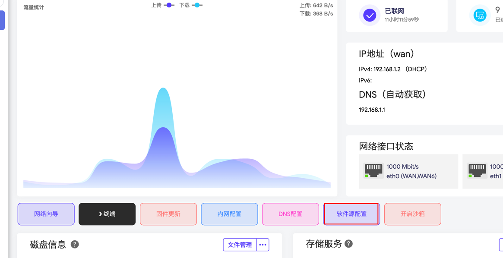
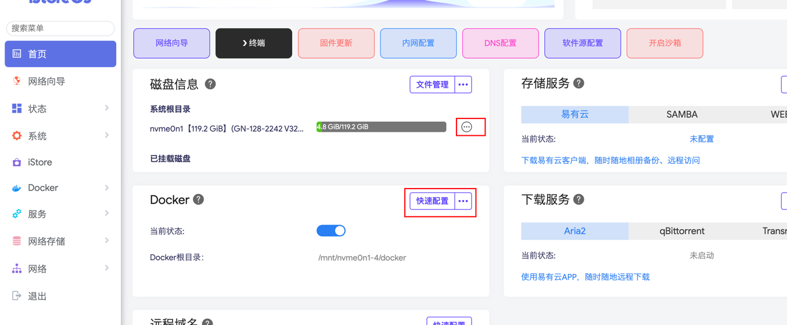
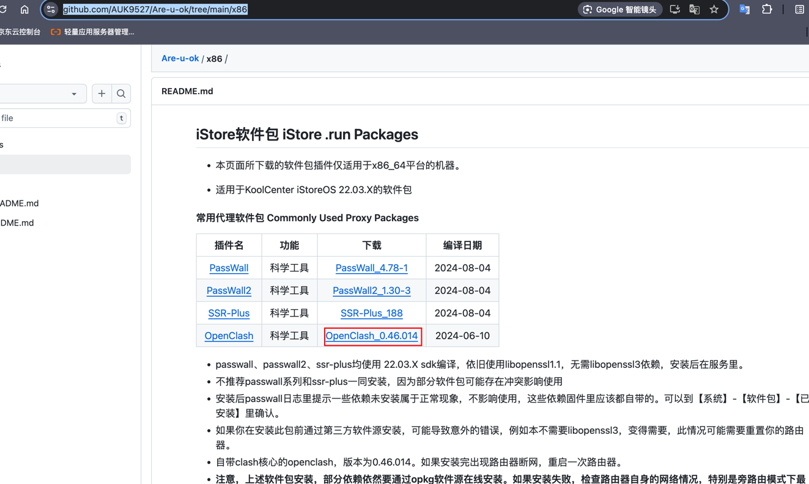
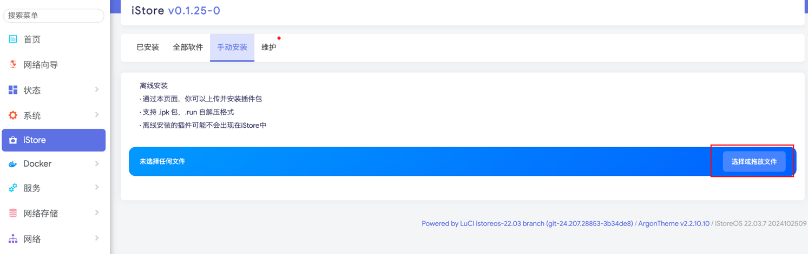
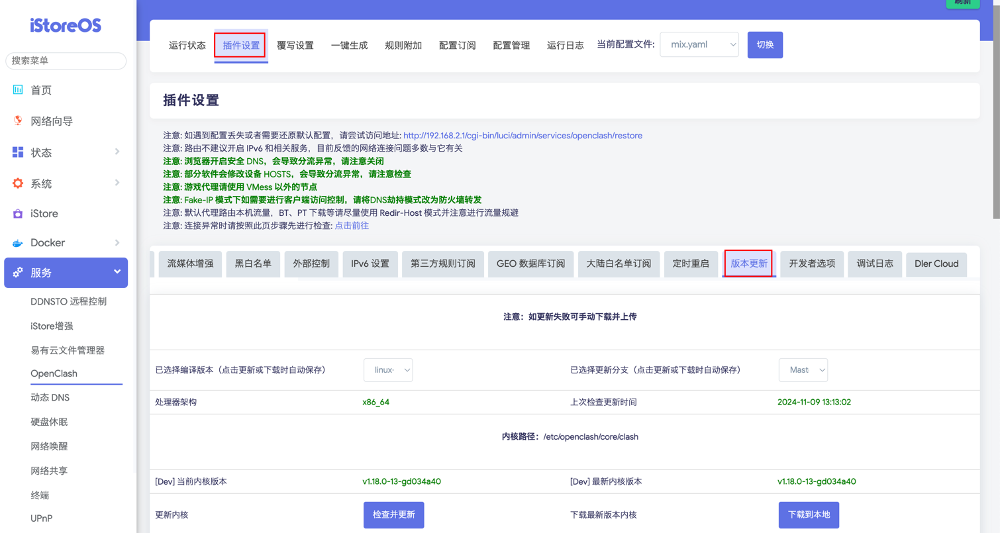
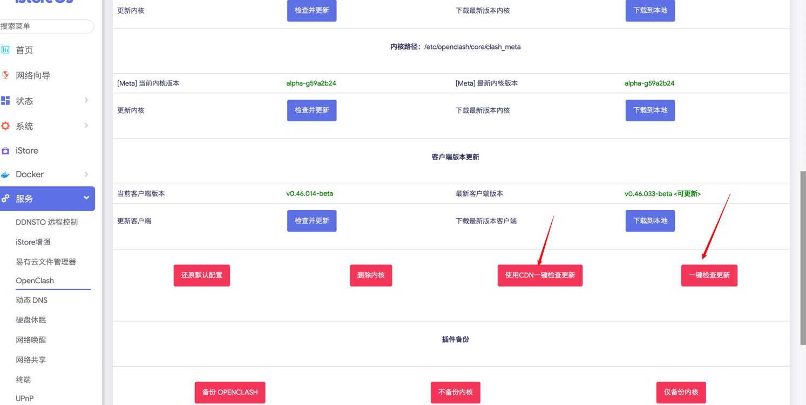
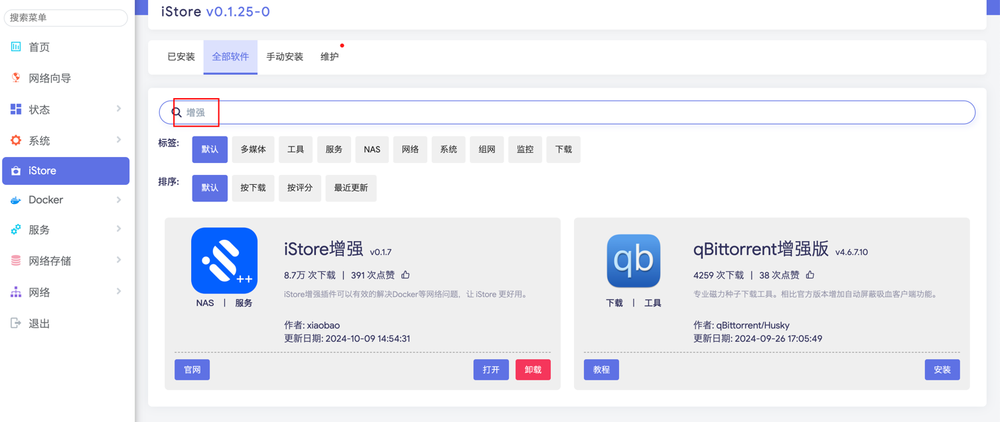
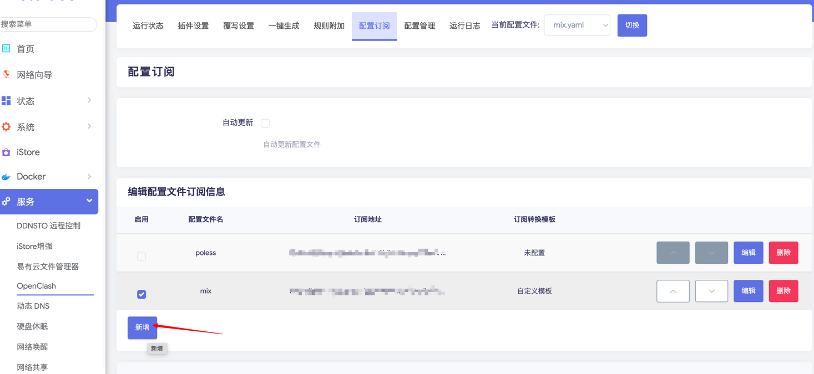
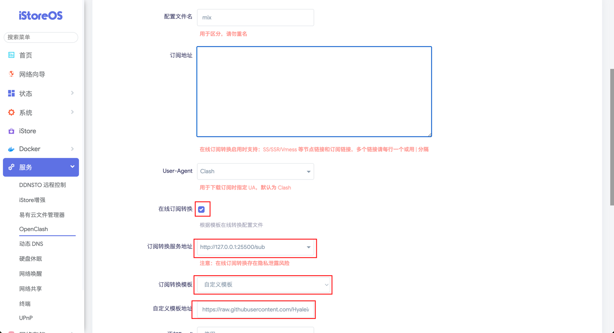
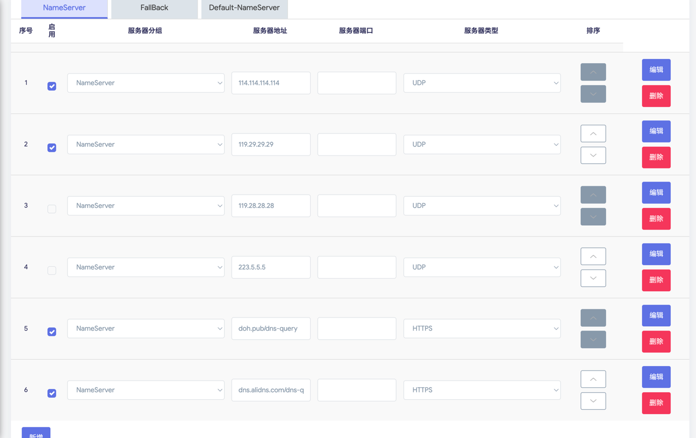

# clash-proxy-rule

### 设置软件源
这步骤很重要，如果跳过此步骤，可能导致手动安装openclash时，报出网络相关错误  
  
我选择的是中国科学技术大学，暂时可用  

### 设置docker分区
这是用于将docker的资源文件迁移到更大的分区，防止以后出现运行docker容器时，空间不够的问题  

具体方法是，先点击系统根目录右侧的三点图标，初始化分区。  
再点击docker右侧的快速配置，根据提示选择具体的迁移路径，点击确定即可  

### 安装subconverter
这是在线规则转换工具，使用自己的在线转换工具可以防止代理连接泄漏  
```shell
docker run -d --restart=always -p 25500:25500 tindy2013/subconverter:latest
```
相关仓库地址  
https://github.com/tindy2013/subconverter


### 下载open clash安装包
相关仓库地址  
https://github.com/AUK9527/Are-u-ok/tree/main/x86  

下载得到文件OpenClash_0.46.014+x86_64_core.run  
将下载的文件拖放到iStore-手动安装栏  


### 插件设置-版本更新
先点击一键检查更新，如果不成功，再点击使用CDN一键检查更新  



### 安装iStoreOS增强
这是用于docker的代理配置，不设置可能无法拉去docker镜像  


### 新增订阅配置
  
分别输入配置文件名  
自己的机场地址  
勾选在线订阅转换  
订阅转换服务地址：http://127.0.0.1:25500/sub  
订阅转换模版：自定义模板  
自定义模板地址：自己维护的.ini转换规则文件  


### 设置dns
点击菜单 覆写设置-常规设置  
如图勾选  

如果还是无法上网，点击 覆写设置-常规设置，勾选自定义上游 DNS 服务器  
同样在NameServer中，勾选几个dns  

### 插件设置-模式设置
运行模式使用tun
### 插件设置-流量控制
仅允许常用端口流量选项，选择默认常用端口，这可以解决steam语音异常问题
